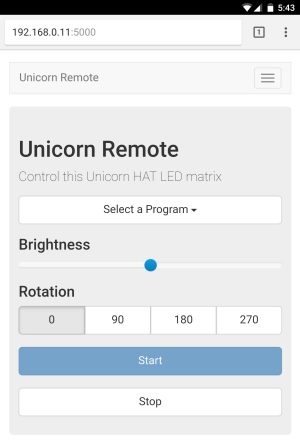

[](https://codeclimate.com/github/njbbaer/unicorn-remote)

Unicorn Remote is a web based remote control for the Unicorn HAT LED matrix. It allows you to control light grid programs from a desktop or mobile browser and a web API.

Supports both the new Unicorn HAT HD 16x16 and original Unicorn HAT 8x8. It comes with a built-in set of programs for both, and allows you add your own.

The [Unicorn HAT](https://shop.pimoroni.com/products/unicorn-hat) and [HAT HD](https://shop.pimoroni.com/products/unicorn-hat-hd) are available from Pimoroni.


*If this software has been useful to you, please **star the repository** to show your interest.*


 


## Setup
1. Follow first time setup for [Unicorn HAT](https://github.com/pimoroni/unicorn-hat) or [Unicorn HAT HD](https://github.com/pimoroni/unicorn-hat-hd)
2. Clone or download the repository:
```
git clone https://github.com/njbbaer/unicorn-remote.git
cd unicorn-remote
```

3. Install the Python packaging tool [Pipenv](https://docs.pipenv.org/):
```
sudo pip install pipenv
```

4. Install dependencies with Pipenv:
```
sudo pipenv install
```

5. Start Unicorn Remote:
```
sudo pipenv run python run.py
```

*Note:* Commands must be run as root

#### Optional Arguments
`-o` `--original` use original 8x8 unicorn hat  
`-d` `--debug` enable Flask debugging mode  
`-p` `--port` `<port>` set port number (default 5000)


## Web Interface
Visit the web interface by directing a browser to the server's address.
```
http://localhost:5000
```

* Choose a program from the dropdown list.
* Select the desired brightness and display rotation.
* Press `Run` to start the program, and `Stop` to end it.


## Custom Programs
To add your own custom program, simply copy it into one of the follow directories:

`app/programs/hd` for 32x32 programs  
**OR**   
`app/programs/original` for original 16x16 programs

**No additional configuration required!**

## REST API
Start a program by placing a PUT request:
```
PUT /api/program/<program_name>
```
* All programs also accept optional query parameters for `brightness` and `rotation`.

Stop the currently running program:
```
PUT /api/stop
```


## Testing
Run the test suite. Enjoy the light show.
```
sudo pipenv run python -m unittest
```


## Contribute
* **Star the repository** to show your interest in this project.
* Give feedback, report bugs, and request features as GitHub issues.
* Improve the repository and submit a pull request.
